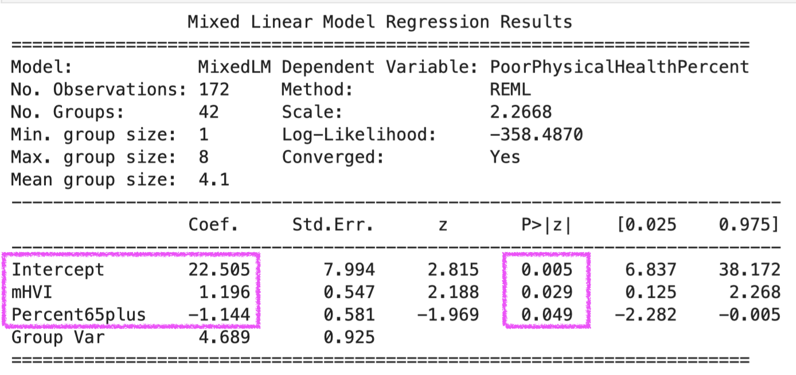
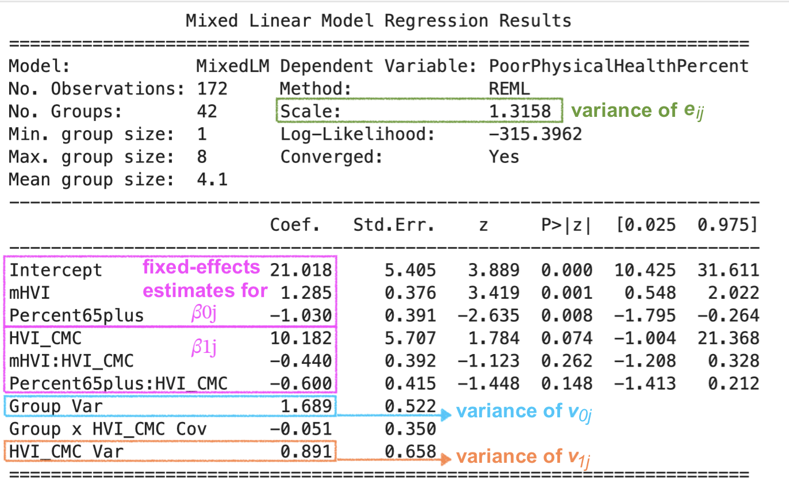
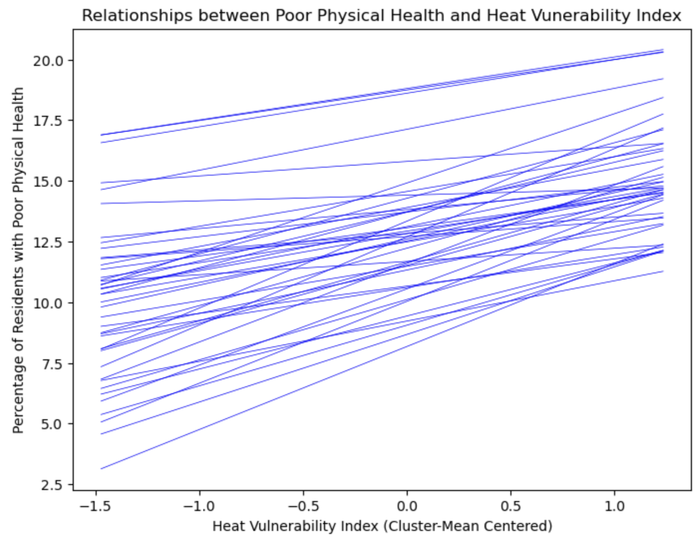

# What are multilevel models?
Also known as hierarchical linear models or mixed-effects models, multilevel models are a statistical approach for handling data with a **hierarchical**, **nested**, or **clustered** structure.<br>

An example of hierarchical data is that children who grew up in the **same homes** with the same parents tend to be more alike than random individuals from the same age groups. <br>

Similarly, students from the **same school** or neighborhood may perform more similarly on standardized tests. In this case, individual students' test scores are considered "nested" within institutions or geographical areas. <br>
<br>


<br>
It is also possible to construct a three-level model in which Level 1 comprises areas within each zip code, Level 2 the neighborhoods, and Level 3 the boroughs. The illustration below uses "UHF42 neighborhoods," which are a set of 42 defined community areas in New York City, created by the NYC Department of Health and Mental Hygiene and the United Hospital Fund (UHF) for health research and planning.<br>
<br>


<br>

# Why use multilevel models?
Nested data **violates key assumptions** of Ordinary Least Squares (OLS) in linear regression, because: <br>

- Observations are not independent <br>

- Error terms are not independent <br>

Some **data structures** that do not appear to be clustered can actually be. Here is an extreme example:<br>
<br>

 
 <sub> Source: "A Fun Intro to Multilevel Models in R" by Fabio Votta of University of Amsterdam </sub> <br>
<br>

Below is a list of helpful resources for getting a basic understanding of multilevel modeling: <br>

- [Multilevel Modeling: A Comprehensive Guide for Data Scientists](https://www.datacamp.com/tutorial/multilevel-modeling)<br>

- [A Fun Intro to Multilevel Models in R](https://favstats.github.io/intro_multilevel/slides/#1)<br>

- [Advanced Statistics: Multilevel Regression](https://advstats.psychstat.org/python/multilevel/index.php)<br>

- [Centering Options and Interpretations](https://www.learn-mlms.com/08-module-8.html)<br>
<br>

# The research question and rationale 
Are the Heat Vulnerability Index (HVI) and the percentage of older population related to the physical health of adults residing in New York City? Do these relationships vary by neighborhood? <br>

In light of climate change, some neighborhoods are more vulnerable to extreme heat than others, such as urban areas with high impervious surfaces, less green and shady surfaces, fewer socioeconomic resources, and a larger population that is disproportionately impacted by heat (e.g., older adults, outdoor workers, and those with lower income). <br>

It is often observed that areas in close spatial proximity tend to share similar characteristics, thus forming "clusters/groups" and motivating researchers to conduct multilevel regressions to investigate both the within-group and between-group effects of risk factors on health outcomes. <br>
<br>

# Health outcome, predictors, model structure, and datasets
In this study, the **health outcome** (Y) is the percentage of adults with **poor physical health** residing in a given zip code, while the two **predictors** (X's) are the average **HVI** by zip code and the percentage of residents aged **65 and older** of each UHF42 neighborhood. Both predictors exhibit a hierarchical data structure, in that each zip code belongs to one of the 42 UHF42 neighborhoods within the five boroughs of New York City. Note that boroughs are the Level 3 of this data structure and are not included in this study's two-layer hierarchical linear model.<br>

In multilevel models, **Level 1** predictors are those that vary within a group (in this study, averaged **HVI** by zip code), whereas **Level 2** variables are characteristics of the group (in this study, the **percentage of residents aged 65 and older** of each UHF42 neighborhood).<br>

This analysis will use five datasets that have been extracted from their linked sources and preprocessed: <br>

- [Health Outcomes by Zip Code](https://datacommons.org/place/geoId/3651000?category=Health)<br>

- [Averaged Heat Vulnerability (HVI) by Zip Code](https://a816-dohbesp.nyc.gov/IndicatorPublic/data-features/hvi/)<br>

- [Risk Factors by Zip Code](https://simplemaps.com/city/new-york/zips/age-median)<br>

- [Risk Factors by Borough](https://furmancenter.org/stateofthecity/view/citywide-and-borough-data)<br> 

- [UHF42 Neighborhood Codes](https://www.nyc.gov/assets/doh/downloads/pdf/ah/zipcodetable.pdf)<br>
<br>

# Data visualization: scatter plots and regression lines
It is always a good idea to visualize the data before modeling to identify patterns, trends, and outliers that are not apparent in raw numbers.<br> 

In this study, an **outlier** (zip code 11005) was detected due to its extremely high median age of residents (80.6 years). Upon further investigation, zip code 11005 contains only one senior center. This data point was removed from the analysis dataset after careful consideration.<br>

The following unicolor scatter plot indicates a **positive** relationship between the average **HVI** and **poor physical health**. In contrast, the multicolor scatter plot further reveals **clusters** of data points at the borough level. <br>
<br>

 

<br>

Interestingly, the unicolor scatter plot below shows a negative relationship between the percentage of **residents aged 65 and older** and **poor physical health**, which is contrary to what one might expect. Note that there is a "clustering effect" by default, as all zip codes from the same borough share the same percentage of residents aged 65 and older.<br>
<br>


<br>
An OLS linear regression on the entire dataset would estimate a single y-intercept and slope for the effect of HVI on poor physical health for *all* residents of NYC, regardless of their borough of residence. In contrast, and as demonstrated below, when the same regression is conducted separately for each borough, five distinct y-intercepts and slopes emerge, supporting the use of a multilevel model.<br>
<br>


<br>

# Data Analysis
Visualization is an intuitive way to get the big picture (pun intended) of our data, but there is a standardized metric we can use to justify the use of a multilevel model. The measurement is called the "intraclass correlation coefficient," or **ICC** for short. <br>
<br>

## Intraclass correlation coefficient (ICC) 
The intraclass correlation coefficient (ICC) is a statistic that measures how strongly units in the same group are related. It is calculated as:<br>

**ICC = Between-Group Variance / Total Variance**
= Between-Group Variance / (Between-Group Variance + Within-Group Variance)<br>

- When ICC = 0, the variance between groups is zero, indicating "all groups are similar," which means the dataset contains no distinct grouping.<br>

- When ICC = 1, there is no variance within the groups, meaning all variance comes from between groups.<br>

- When 0 < ICC < 1, it tells the degree of between-group differences. For example, an ICC of 0.78 means that 78% of the total variance is due to differences between the groups. <br>

The higher the ICC, the stronger the justification for using a multilevel model to investigate between-group differences. An ICC of 0.78 is considered very high, and it is most definitely beneficial to use a multilevel model in this case.<br>
<br>

## The null model
To calculate the ICC, we must first run a **null model**, which is a baseline model that estimates the between-group variance and the within-group variance.<br>

In regression, a null model is usually the simplest possible model that includes only an intercept (the mean value of Y) and no predictor variables. It represents a case in which the predictors have no effect on the outcome (i.e., the risk factors of interest are not related to the health outcome). If the variances are large under the null assumption, it means that a more complex model involving predictors should be evaluated.<br> 
 
First, load the necessary libraries. The model we want to use is a **mixed linear model** (***mixedlm***), from the ***statsmodel*** library.<br>

Specify the null model, fit it, and then print the results. For this study, I will conduct a two-level mixed linear regression, with **UHF42** neighborhoods as the Level 2 groups.<br>


```python
import statsmodels.api as sm
import statsmodels.formula.api as smf 

null_model = smf.mixedlm("PoorPhysicalHealthPercent ~ 1", data=df, groups=df["UHF42"])

results_null = null_model.fit()
print(results_null.summary())
```


<br>

Using the **Between-Group Variance** and the **Within-Group Variance** estimated by the model, we can now calculate the ICC: <br>

**ICC** = Between-Group Variance / Total Variance<br>
&nbsp;&nbsp;&nbsp;&nbsp;= Between-Group Variance / (Between-Group Variance + Within-Group Variance)<br>
 &nbsp;&nbsp;&nbsp;&nbsp;= 7.958 / (7.958 + 2.2614) = **0.78**<br>
 <br>

## Cluster-mean centering
It is worth noting that, for this multilevel regression, the HVI predictor was cluster-mean centered (also known as group-mean centered). In other words, the arithmetic mean of HVI for each cluster (UHF42 neighborhood) was subtracted from each observation’s HVI value in the corresponding neighborhood.<br>

**Mean centering** is a popular technique used in linear regression models when predictors do not have meaningful zero points. In this study, HVI has no meaningful zero  because the Heat Vulnerability Index ranges from 1 to 5. Without centering it, the y-intercept would represent the average percentage of residents with poor physical health when HVI is zero, which is out of range for the index.<br>

Other reasons for centering are to reduce multicollinearity and to simplify interpretations when interaction terms are included in the model.<br>

There are two options for centering in multilevel models: grand-mean centering or cluster-mean centering. Since we are interested in the Level 2 predictor, **cluster-mean centering** is chosen because it provides an unbiased estimate of the within-cluster effect and produces better estimates of the slope variance.<br>
<br>

## Fixed effects vs. random effects
In multilevel models, **fixed effects** focus on generalizable patterns and relationships (y-intercept and slope) that are assumed to be consistent across all groups of analysis.<br> 

In contrast, **random effects** capture group-specific variation by allowing variability between groups and estimating parameters that vary across groups or clusters. There are two parameters for random effects:<br>

- **Random intercepts** estimate the variation in the baseline (intercept) between groups. For example, in this study, random intercepts allow each neighborhood to have a unique average percentage of residents with poor health, thus reflecting differences in baseline performance across different neighborhoods. <br>

- **Random slopes** capture the relationship between a predictor and the outcome across groups or clusters. If the effect of HVI on poor health varies across neighborhoods, this can be modeled using random slopes, where each neighborhood has its own unique relationship (slope) between HVI and poor physical health. <br>
<br>

## Fixed-effects model specification
As mentioned earlier, the averaged HVI predictor is cluster-centered. The cluster means are represented by *mHVI<sub>j</sub>* for neighborhood *j*. <br>

Conceptually, to get the **fixed-effects parameters**, we specify the model as:<br>

**Poor Health** = 𝛽<sub>0</sub> + 𝛽<sub>1</sub> ***mHVI<sub>j</sub>*** + 𝛽<sub>2</sub>***Age65<sub>j</sub>*** + *v<sub>j</sub>* + *e<sub>ij</sub>* <br>

where *i* represents the individual zip code and *j* the UHF neighborhood.<br>

𝛽<sub>0</sub>, 𝛽<sub>1</sub>, and 𝛽<sub>2</sub> are fixed-effects parameters whose estimates can be extracted from the output table.<br>

```python
model_fixedE = smf.mixedlm("PoorPhysicalHealthPercent ~ mHVI + Percent65plus", data=df, groups=df["UHF42"])

results_fixedE = model_fixedE.fit()

print(results_fixedE.summary())
```

<br>



<br>

Based on the output of the analysis, both **mHVI** and **Percent65plus** are **significant**, given the *p*-values in the results table.<br>
<br>

## Two-level model specification
Conceptually, the two-level model can be specified as:<br>
**Poor Health** = 𝛽<sub>0j</sub> + 𝛽<sub>1j</sub> ***mHVI<sub>ij</sub>*** + *e<sub>ij</sub>* <br>
 &nbsp;&nbsp;&nbsp;&nbsp;&nbsp;&nbsp;&nbsp;&nbsp;&nbsp;&nbsp;&nbsp;&nbsp;
= γ<sub>0</sub> + γ<sub>1</sub> ***mHVI<sub>j</sub>*** + γ<sub>2</sub>***Age65<sub>j</sub>*** + *v<sub>0j</sub>* <br>
    &nbsp;&nbsp;&nbsp;&nbsp;&nbsp;&nbsp;&nbsp;&nbsp;&nbsp;&nbsp;&nbsp;&nbsp;&nbsp;&nbsp;
    + (γ<sub>3</sub> + γ<sub>4</sub>***mHVI<sub>j</sub>*** + γ<sub>5</sub>***Age65<sub>j</sub>*** + *v<sub>1j</sub>) x ***HVI<sub>ij</sub>*** + *e<sub>ij</sub>* <br>

where **γ**s are **fixed-effects** and ***v<sub>0j</sub>*** and ***v<sub>1j</sub>*** are **random effects**<br>

In Python, each term in the mixed-effects model must be specified except for *e<sub>ij</sub>*, which means there will be two interaction terms.<br> 

The random effects are specified using the option **re_formula = "~1 + HVI"** where 1 and HVI specify that the coefficients vary for the grouping variable (i.e., UHF42 neighborhoods).<br>

As a reminder, the HVI variable in this model is cluster-mean-centered and named *HVI_CMC*.<br>  

```python
model_2level = smf.mixedlm("PoorPhysicalHealthPercent ~ mHVI + Percent65plus + HVI_CMC + mHVI*HVI_CMC + Percent65plus*HVI_CMC", data=df, groups=df["UHF42"], re_formula="~1 + HVI_CMC")

results_2level = model_2level.fit()

print(results_2level.summary())
```

<br>

 

<br>

The parameters in the table of **fixed effects** give the estimates for **γ**s that can be plugged back into the equations to calculate 𝛽<sub>0j</sub> and 𝛽<sub>1j</sub>, as follows: <br>

𝛽<sub>0j</sub> = 16.237 + 1.693 ***mHVI<sub>j</sub>*** - 0.733 ***Age65<sub>j</sub>*** <br>
𝛽<sub>1j</sub> = 6.309 - 0.502 ***mHVI<sub>j</sub>*** - 0.261 ***Age65<sub>j</sub>***  <br>

As 𝛽<sub>0j</sub> is the y-intercept for neighborhood *j*, the first equation shows that neighborhoods with higher HVI have a higher average percentage of adults with poor physical health than those with lower HVI. <br>

Similarly, as 𝛽<sub>1j</sub> is the slope for neighborhood *j*, the second equation indicates that neighborhoods with a high HVI will experience a smaller increase in the percentage of adults with poor physical health than neighborhoods with a low HVI. <br>

The random-effects parameters are also shown and marked on the output. The individual values for each neighborhood can be obtained by using the ***random_effects*** attribute of the fitted model. With these values, the individual neighborhood-specific regression lines can be plotted as follows:<br>
<br>



<br>

# Results interpretations and implications
The results show a clear positive relationship between HVI and the percentage of adult residents with poor physical health across ***all neighborhoods***, though to varying degrees.<br>

Neighborhoods with higher HVIs have a larger portion of their adult residents in poor physical health. However, it is the neighborhoods with low HVIs that will see a relatively larger increase in the proportion of their adult residents with poor physical health.<br>

Therefore, public health **mitigation** measures should target neighborhoods with a high HVI, while **prevention** measures should 
focus on neighborhoods whose current lower HVI is likely to rise considerably due to climate change. <br>
<br>

# Future uses
One can use the same model to investigate two other **health outcomes**: the percentage of adults with poor mental health (PoorMentalHealthPercent) and the percentage of adults with high blood pressure (HighBPPercent) residing in the area with a given zip code.<br> 

To investigate alternative **predictors**, one can choose from MedianAge, MedianIncome, PercentCollege, PercentMale, PercentMarried, PercentWhite, PercentBlack, PercentAsian, PercentOtherRaces, ForeignBornPercent, RacialDiversityIndex, MedianHouseholdIncome, PovertyRate, UnemployRate, BAdegreePercent, and HomeownershipPercent. <br>

For example, by using BAdegreePercent (percentage of residents with a BA degree) and PercentMarried as predictors (X’s) and PercentHighBP as the health outcome (Y), one can investigate the effects of education level and marital status on the percentage of adults with high blood pressure in NYC, and (2) whether those effects differ for each of the 42 UHF neighborhoods. <br>

Here is the [MLM_dataframe](assets/images/MLM_dataframe.csv) with all the variables mentioned above.<br>


