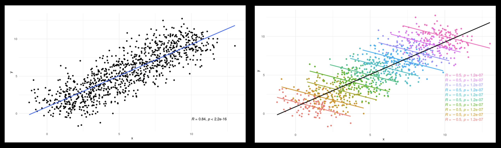

# What are multilevel models?
Some data have a **hierarchical** or **clustered** structure. For example, children who grew up in the same households with the same parents tend to be more alike than random individuals from the same age groups.  
 
Similarly, students from the same school or neighborhoods may perform more similarly on standardized tests. In this case, individual students' test scores are considered "nested" within institutions or geographical areas.  
 

 
 

# Why use multilevel models?
1. Nested data **violate key assumptions** of Ordinary Least Squares (OLS) in linear regression, because:  
* Observations are not independent  
* Error terms are not independent  
 

2. Some **data structures** that do not appear to be clustered can actually be. Here is an extreme example: 
 
  Source: "A Fun Intro to Multilevel Models in R" by Fabio Votta of University of Amsterdam 
  
  
3. Below is a list of helpful resources for getting a basic understanding on multilevel modeling:  
* [Multilevel Modeling: A Comprehensive Guide for Data Scientists](https://www.datacamp.com/tutorial/multilevel-modeling) 
* [A Fun Intro to Multilevel Models in R](https://favstats.github.io/intro_multilevel/slides/#1) 
* [Advanced Statistics: Multilevel Regression](https://advstats.psychstat.org/python/multilevel/index.php)
* [Centering Options and Interpretations](https://www.learn-mlms.com/08-module-8.html) 
 
 

# The research question and rationale 
Are Heat Vulnerability Index (HVI) and poor mental health related to the physical health of adults residing in New York City? Do those relationships differ depending on the borough?  

In light of climate change, some areas are more vulnerable to extreme heat than others, such as urban areas with high impervious surfaces, less green and shady surfaces, fewer socioeconomic resources, and a larger population that are disproportionately impacted by heat (e.g., older adults, outdoor workers, and those with lower income).  

It is often observed that areas in close spatial proximity tend to share similar characteristics, thus forming "clusters/groups" and motivating researchers to conduct multilevel regressions to investigate both the within-group and between-group effects of risk factors on health outcome.  
 
 

# Datasets, health outcome and predictor variables
In this study, the **health outcome** (Y) is the percentage of adults with **poor physical health** residing in a given zip code, while the two **predictors** (X's) are averaged **HVI** and percentage of adults with **poor mental health**, both of which exhibit a hierarchical data structure in the sense that each zip code belongs to one of the five boroughs. 
 
This analysis will use three datasets that have been extracted from their linked sources and preprocessed:  
* [Health Outcomes by Zip Code](https://datacommons.org/place/geoId/3651000?category=Health) 
* [Averaged Heat Vulnerability (HVI) by Zip Cod](https://a816-dohbesp.nyc.gov/IndicatorPublic/data-features/hvi/) 
* [Risk Factors by Zip Code](https://simplemaps.com/city/new-york/zips/age-median) 
 
 

# Data visualization: scatter plots & regression lines
It is always a good idea to visualize the data before modeling to identify patterns, trends, and outliers that are not apparent in raw numbers.  
 
In this study, an **outlier** (zip code 11005) was detected because the median age of residents is 80.6 years old. Upon further investigation, this zip code contains only a senior center. This data point was removed from the analysis dataset. 
 

