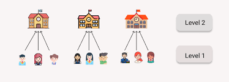
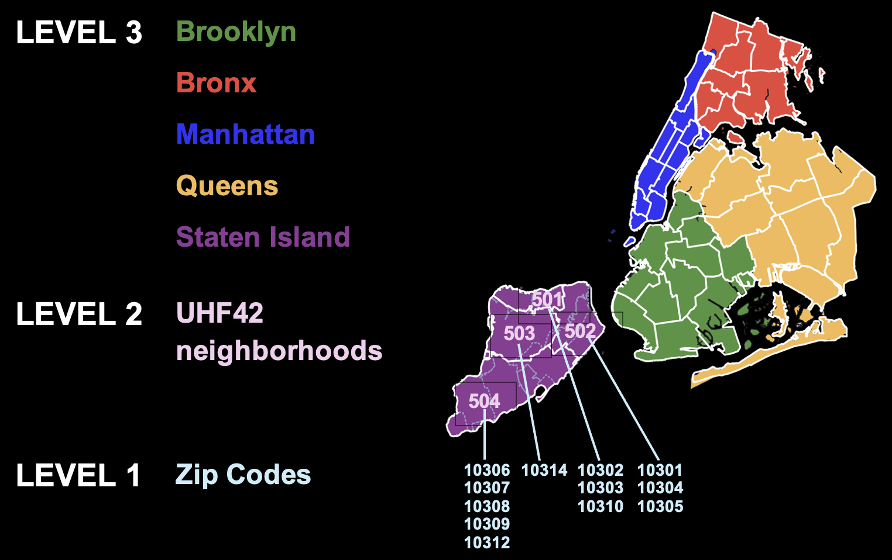
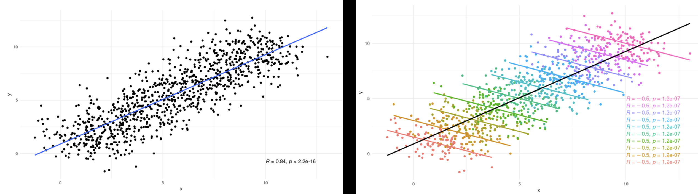
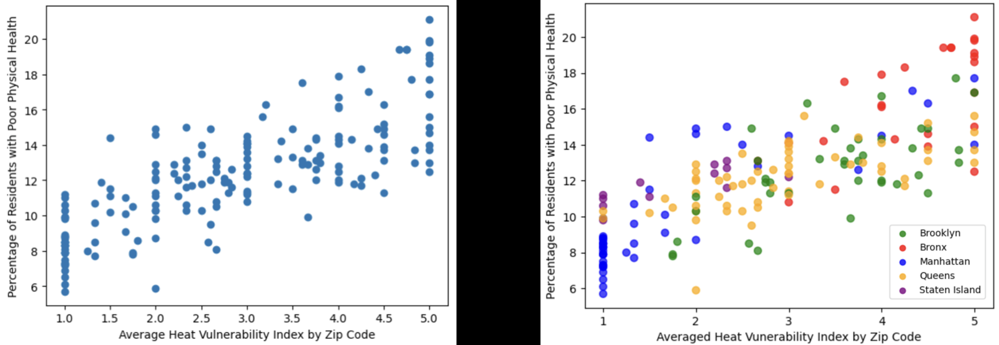
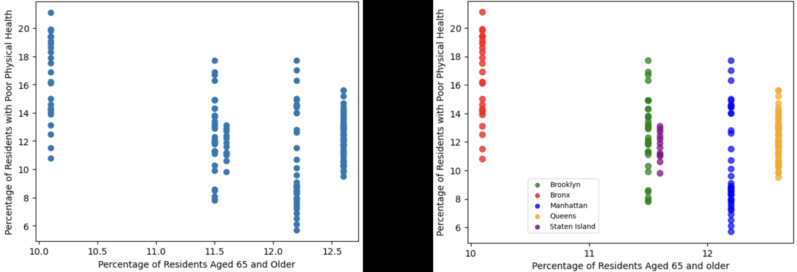
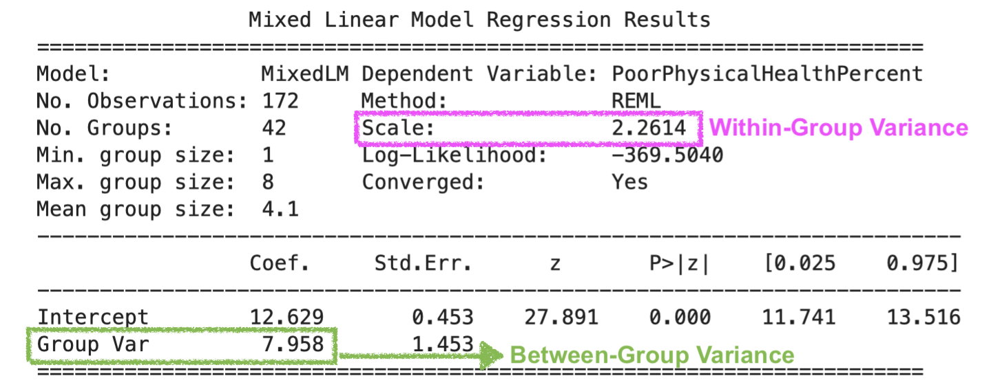

# What are multilevel models?
Some data have a **hierarchical** or **clustered** structure. For example, children who grew up in the same households with the same parents tend to be more alike than random individuals from the same age groups. <br>
<br>
Similarly, students from the same school or neighborhoods may perform more similarly on standardized tests. In this case, individual students' test scores are considered "nested" within institutions or geographical areas. <br>
<br>

<br>
<br>
It is also possible to construct a three-level model where Level 1 is areas of each zip code, Level 2 is neighborhoods, and Level 3 is boroughs. The illustration below uses "UHF42 neighborhoods," which are a set of 42 defined community areas in New York City, created by the NYC Department of Health and Mental Hygiene and the United Hospital Fund (UHF) for health research and planning.<br>
<br>


# Why use multilevel models?
1. Nested data **violate key assumptions** of Ordinary Least Squares (OLS) in linear regression, because: <br>
* Observations are not independent <br>
* Error terms are not independent <br>
<br>

2. Some **data structures** that do not appear to be clustered can actually be. Here is an extreme example:<br>
 
 <sub> Source: "A Fun Intro to Multilevel Models in R" by Fabio Votta of University of Amsterdam </sub>
 <br>
 <br>
3. Below is a list of helpful resources for getting a basic understanding on multilevel modeling: <br>
* [Multilevel Modeling: A Comprehensive Guide for Data Scientists](https://www.datacamp.com/tutorial/multilevel-modeling)<br>
* [A Fun Intro to Multilevel Models in R](https://favstats.github.io/intro_multilevel/slides/#1)<br>
* [Advanced Statistics: Multilevel Regression](https://advstats.psychstat.org/python/multilevel/index.php)
* [Centering Options and Interpretations](https://www.learn-mlms.com/08-module-8.html)<br>
<br>
<br>

# The research question and rationale 
Are Heat Vulnerability Index (HVI) and poor mental health related to the physical health of adults residing in New York City? Do those relationships differ depending on the neiborhood? <br>

In light of climate change, some neighborhoods are more vulnerable to extreme heat than others, such as urban areas with high impervious surfaces, less green and shady surfaces, fewer socioeconomic resources, and a larger population that are disproportionately impacted by heat (e.g., older adults, outdoor workers, and those with lower income). <br>

It is often observed that areas in close spatial proximity tend to share similar characteristics, thus forming "clusters/groups" and motivating researchers to conduct multilevel regressions to investigate both the within-group and between-group effects of risk factors on health outcome. <br>
<br>
<br>

# Health outcome, predictors, model structure, and datasets
In this study, the **health outcome** (Y) is the percentage of adults with **poor physical health** residing in a given zip code, while the two **predictors** (X's) are averaged **HVI** by zip code and the percentage of residents aged **65 and older** of each UHF neighborhood, both of which exhibit a hierarchical data structure in the sense that each zip code belongs to one of the five boroughs.<br>
<br>
In multilevel models, **Level 1** predictors are those that vary within a group (in this study, averaged **HVI** by zip code), whereas **Level 2** variables are characteristics of the group (in this study, the **percentage of residents aged 65 and older** of each UHF42 neighborhood).<br>
<br>
This analysis will use five datasets that have been extracted from their linked sources and preprocessed: <br>
* [Health Outcomes by Zip Code](https://datacommons.org/place/geoId/3651000?category=Health)<br>
* [Averaged Heat Vulnerability (HVI) by Zip Cod](https://a816-dohbesp.nyc.gov/IndicatorPublic/data-features/hvi/)<br>
* [Risk Factors by Zip Code](https://simplemaps.com/city/new-york/zips/age-median)<br>
* [Risk Factors by Borough](https://furmancenter.org/stateofthecity/view/citywide-and-borough-data)<br> 
* [UHF42 Neighborhood Codes](https://www.nyc.gov/assets/doh/downloads/pdf/ah/zipcodetable.pdf)
<br>
<br>

# Data visualization: scatter plots & regression lines
It is always a good idea to visualize the data before modeling to identify patterns, trends, and outliers that are not apparent in raw numbers.<br> 
<br>
In this study, an **outlier** (zip code 11005) was detected because of its extremely high median age of residents (80.6 years old). Upon further investigation, zip code 11005 contains only one senior center. This data point was removed from the analysis dataset as a result.<br>
<br>
The following unicolor scatter plot indicates a **positive** relationship between averaged **HVI** and **poor physical health**, while the multicolor scatter plot further reveals **clusters** of data points at the borough level. <br>
<br>

 
<br>
<br>
Interestingly, the unicolor scatter plot below shows a negative relationship between percentage of **residents aged 65 and older** and **poor physical health**, which is contrary to what one might expect. There is a "clustering effect" by default, as all zip codes from the same borough share the percentage of residents aged 65 and older.<br>
<br>

<br>
<br>
Conducting an OLS linear regression on the entire dataset, one would estimate a single y-intercept and slope for the effect of HVI on poor physical health for *all* residents of NYC, regardless of their borough of residence. However, when the same regression is conducted separately for each borough, five district y-intercepts and slopes emerge, supporting the use of a multilevel model.<br>
<br>

<br>
<br>

# Data Analysis
Visualization is an intuitive way to get the big picture (pun intended) of our data, but there a standardized measurement we can use to justify using a multilevel model. The measurement is called "intraclass correlation coefficient," or ICC for short. <br>
<br>

## Intraclass correlation coefficient (ICC) 
Intraclass correlation coefficient (ICC) is a statistic that measures how strongly units in the same group are related. It is calculated as:<br>
<br>
**ICC = Between-Group Variance / (Between-Group Variance + Within-Group Variance)**<br>
<br>
- When ICC = 0, there is no variance within the groups, meaning all variance comes from between groups. In contrast.<br>
<br>
- When ICC = 1, the varaiance between groups is zero, indicating "all groups are similar," which means the dataset contains no distinct grouping.<br>
<br>
- When 0 < ICC < 1, it tells the degree of between-group differences. For example, an ICC of 0.78 means that 78% of total variance is due to differences between the groups. <br>
<br>

## The null model
To calculate the ICC, we must first run a **null model**, which is a baseline model that estimates the between-group variance and the within-group variance.<br>
<br>
In regression, a null model is usually the simplest possible model involving only an intercept (the mean value of Y) with no predictor variables. It represents a case where the predictors have no effect on the outcome (i.e., the risk factors studied do not impact the health outcome). If the variances are large under the null assumption, it means a more complex model involving predictors should be evaluated.<br> 
<br> 
First load the necessary libraries--the model we want to use is **mixed linear model**, or ***mixedlm***, from the ***statsmodel*** library.<br>
<br>
Specify the null model, fit the model, and then print out the results. For our study, we will be conducting a two-level mixed linear regression, where the Level 2 groups are **UHF42** neighborhoods.<br>
<br>
```
import statsmodels.api as sm
import statsmodels.formula.api as smf 

null_model = smf.mixedlm("PoorPhysicalHealthPercent ~ 1", data=analysis_df, groups=analysis_df["UHF42"])

results_null = null_model.fit()
print(results_null.summary())

```

<br>


<br>
<br>

Using the **Between-Group Variance** and the **Within-Group Variance** estimated by the model, we can now calculate the ICC: <br>

**ICC** = Between-Group Variance / (Between-Group Variance + Within-Group Variance)<br>
= 7.958 /(7.958 +2.2614) = **0.78**<br>
<br>
<br>
## Cluster-mean centering
Centering the averaged HVI is necessary, because the index ranges from 1 to 5. Without centering averaged HVI, the y-intercept would represent the average percentage of adults with poor physical health when HVI is 0, which is not a valid index value. <br>
<br>
Other reasons for centering are to reduce multicollinearity and to simplify interpretations when interaction terms are included in the model.<br>
<br>
There are two options for centering in multilevel models, namely, grand-mean centering and cluster-mean centering. Since we are interested in the Level 2 predictor, **cluster-mean centering** is chosen because it gives an unbiased estimate of the within cluster effect and produces better estimates of the slope variance.<br>
<br>
## Two-level model specification
